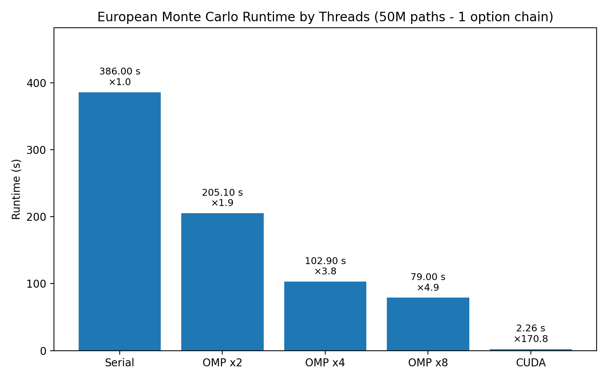
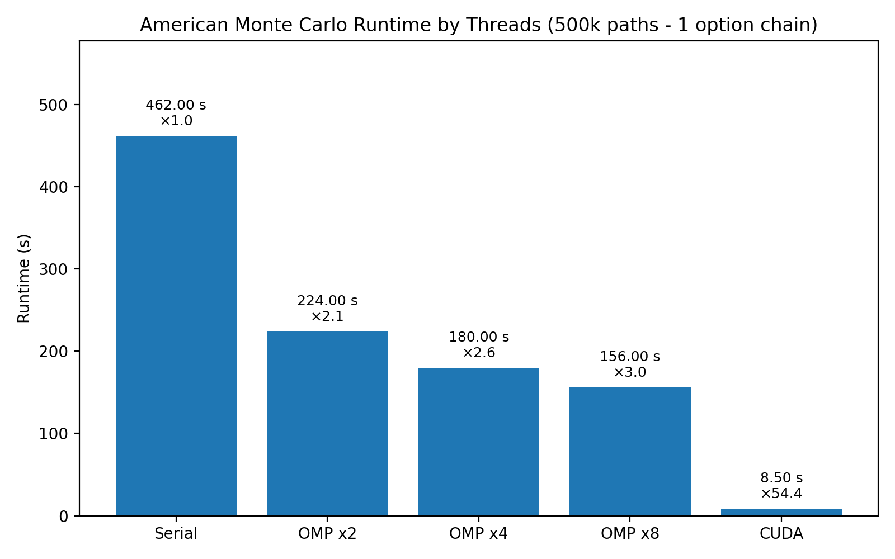

# High Performance Computing: European & American Option Pricer

This project implements a high-performance Monte Carlo simulation engine to price European and American options using real-time market data. It supports both CPU-parallelized (OpenMP) and GPU-accelerated (CUDA) implementations.

## 📈 Overview

The program calculates the fair price of a European and American call and put option based on:
- `S`: Stock price (live from Tradier API)
- `X`: Strike price (live from Tradier API)
- `T`: Time to expiration (in years)
- `σ` (sigma): Volatility (live from Tradier API)
- `r`: Risk-free interest rate (live from FRED 3-month Treasury Bill rate)

⚠️ Note: Since r is based on the 3-month T-bill rate, this model is most accurate for maturities under 3 months. For longer expirations, r should be adjusted accordingly.

- **European options** are priced with Monte Carlo simulations and validated against the **Black–Scholes closed form**.
- **American options** are priced with the **Longstaff–Schwartz algorithm (LSM)**, parallelized on both CPU and GPU.

---

## 🧪 Usage

```bash
./pricer --symbol TICKER --threads THREAD_COUNT --paths NUM_SIMULATIONS --pricer TYPE
```

OR (for offline option pricing from a CSV file) 

CSV file format: Stock,Strike,Expiration,RiskFreeRate,Volatility(sigma)

```bash
./pricer --csv FILE --threads THREAD_COUNT --paths NUM_SIMULATIONS --pricer TYPE
```

Parameters:
- `TICKER`: Stock symbol (e.g., AAPL)
- `THREAD_COUNT`: Number of CPU threads to parallelize simulations (only applies to the OpenMP version)
- `NUM_SIMULATIONS`: Number of Monte Carlo paths to generate
- `FILE`: CSV file for offline option pricing / testing 
- `TYPE`: US or EU monte carlo simulation (type in 'eu' / 'us')

💡 Currently, the simulations are parallelized per option, not per stock. So the performance benefits scale better with fewer options and more simulations.

Example:
- ✅ 20 options × 10M simulations → Good parallelism
- ❌ 5000 options × 100 simulations → Poor GPU/CPU utilization

---

## 📊 Performance Benchmarks

European Monte Carlo Runtime (500k paths, 90 options)



American Monte Carlo Runtime (500k paths, 90 options, 20 steps)



## ⚙️ Project Structure

There are two branches:
- `main` — CPU version using OpenMP
- `cuda_port` — GPU version using CUDA

Each branch contains the same interface and functionality, but leverages different hardware acceleration models for comparison and performance benchmarking.

---

## 📦 APIs Used

- Tradier API - Options Chain: https://documentation.tradier.com/brokerage-api/markets/get-options-chains
- Tradier API - Stock Quotes: https://documentation.tradier.com/brokerage-api/markets/get-quotes
- FRED API - 3-Month Treasury Bill Rate: https://fred.stlouisfed.org/docs/api/fred/

---

## 🚀 Future Plans

- Expand GPU acceleration (CUDA) to support pricing thousands of options efficiently
- Integrate variance reduction techniques (e.g., antithetic variates, control variates)
- Add visualization and performance benchmarks comparing OpenMP and CUDA performance

---

## 📎 Author

Feel free to explore the `cuda_port` branch for the latest GPU-accelerated implementation.